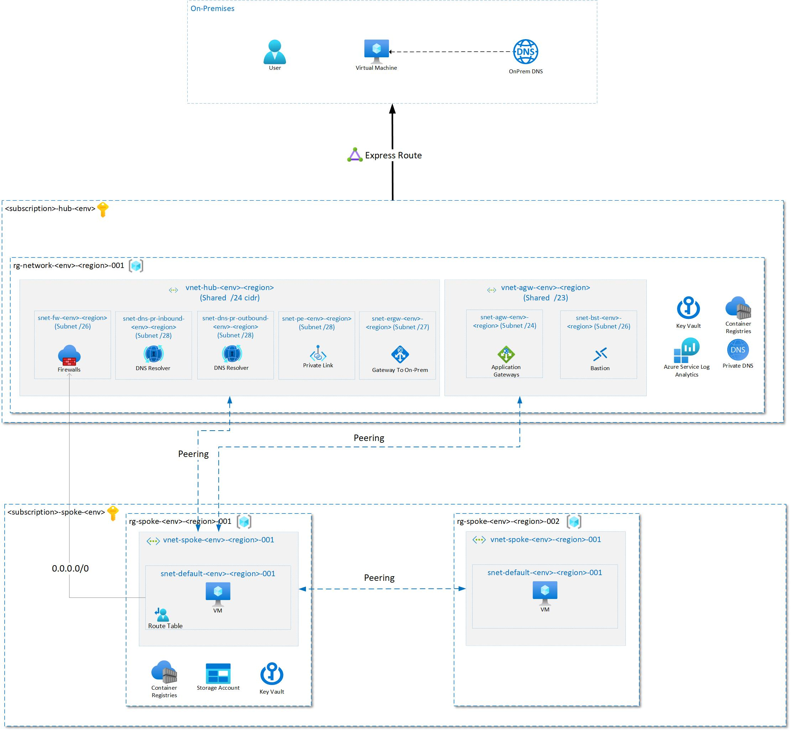

# Infrastructure as Code

## Architecture

The following diagram shows a simplified version of a Hub & Spoke architecture on Azure.



## Getting started

- Install PowerShell Module. Run the following command within your PowerShell: 
  
  ```powershell
  Install-Module -Name Az
  ```

- Set some environment variabels before running the scripts:
  
  ```powershell
  $AZURE_SUBSCRIPTION_ID_HUB = 'HUB_SUBSCRIPTION_ID'
  $AZURE_SUBSCRIPTION_ID_SPOKE = 'SPOKE_SUBSCRIPTION_ID'
  $DNS_SERVER_ON_PREM_IP='INSERT_IP_HERE'
  $HOSTNAMES_ON_PREM=@('HOSTNAME_ON_PREM_1.','HOSTNAME_ON_PREM_2.') # don't forget about the trailing dots at the end!
  ```

- **Setup basic Hub infrastructure:**
  - There are 5 different packages which can be executed independently:
    1. Setup the central Hub: [`./hub/main.ps1`](hub/main.ps1)
    2. Setup the central Application GW Hub: [`./hub_agw/main.ps1`](hub_agw/main.ps1)
    3. Setup the Spoke: [`./spoke_odus/main.ps1`](spoke_odus/main.ps1)
    4. Setup another Spoke: [`./spoke_pim/main.ps1`](spoke_pim/main.ps1)
    5. Setup VNET peering: [`./vnet_peering/main.ps1`](vnet_peering/main.ps1)
  - **Hint:** All variabels will be managed centrally in the `_variables.ps1` file within the packages.
- **Setup Connection to On-Prem:**
  - Run scripts consisting of ExpressRoute configuration
  - Make sure that you deploy the ExpressRoute into the subnet within the previously created infrastructure

## Network

- **Hint:**
  - ENV: Describes the development environment. (dev, staging, prod, etc.)
  - LOCATION: Describes the Region in Azure. (westeurope, eastus, etc.)

### Hub VNET

- Name: `vnet-hub-{ENV}-{LOCATION}-001`
- Example network: `53.13.252.0/24`

#### Subnets

The following table shows the network segmentation consisting of all existing subnets.

| Subnet address | Netmask         | Range of addresses      | Useable IPs             | Hosts | Subnet name                              |
|----------------|-----------------|-------------------------|-------------------------|-------|--------------------------------------|
| 53.13.252.0/26    | 255.255.255.192 | 53.13.252.0 - 53.13.252.63    | 53.13.252.1 - 53.13.252.62    | 62    | -                                    |
| 53.13.252.64/27   | 255.255.255.224 | 53.13.252.64 - 53.13.252.95   | 53.13.252.65 - 53.13.252.94   | 30    | GatewaySubnet                      |
| 53.13.252.96/27   | 255.255.255.224 | 53.13.252.96 - 53.13.252.127  | 53.13.252.97 - 53.13.252.126  | 30    | -                                    |
| 53.13.252.128/26  | 255.255.255.192 | 53.13.252.128 - 53.13.252.191 | 53.13.252.129 - 53.13.252.190 | 62    | AzureFirewallSubnet               |
| 53.13.252.192/28  | 255.255.255.240 | 53.13.252.192 - 53.13.252.207 | 53.13.252.193 - 53.13.252.206 | 14    | snet-dns-pr-inbound-{ENV}-{LOCATION}-001   |
| 53.13.252.208/28 | 255.255.255.240 | 53.13.252.208 - 53.13.252.223 | 53.13.252.209 - 53.13.252.222 | 14    | snet-dns-pr-outbound-{ENV}-{LOCATION}-001 |
| 53.13.252.224/28  | 255.255.255.240 | 53.13.252.224 - 53.13.252.239 | 53.13.252.225 - 53.13.252.238 | 14    | snet-private-link-{ENV}-{LOCATION}-001     |
| 53.13.252.240/28  | 255.255.255.240 | 53.13.252.240 - 53.13.252.255 | 53.13.252.241 - 53.13.252.254 | 14    | -                                    |

### Application Gateways VNET

- Name: `vnet-agw-{ENV}-{LOCATION}-001`
- Example network: `172.16.224.0/23`

#### Subnets

The following table shows the network segmentation consisting of all existing subnets.

| Subnet address | Netmask         | Range of addresses      | Useable IPs             | Hosts | Subnet name                 |
|----------------|-----------------|-------------------------|-------------------------|-------|-------------------------|
| 172.16.224.0/24    | 255.255.255.0   | 172.16.224.0 - 172.16.224.255   | 172.16.224.1 - 172.16.224.254   | 254   | snet-agw-{ENV}-{LOCATION}-001 |
| 172.16.225.0/25    | 255.255.255.128 | 172.16.225.0 - 172.16.225.127   | 172.16.225.1 - 172.16.225.126   | 126   | -                       |
| 172.16.225.128/26  | 255.255.255.192 | 172.16.225.128 - 172.16.225.191 | 172.16.225.129 - 172.16.225.190 | 62    | AzureBastionSubnet |
| 172.16.225.192/26  | 255.255.255.192 | 172.16.225.192 - 172.16.225.255 | 172.16.225.193 - 172.16.225.254 | 62    | -                       |
